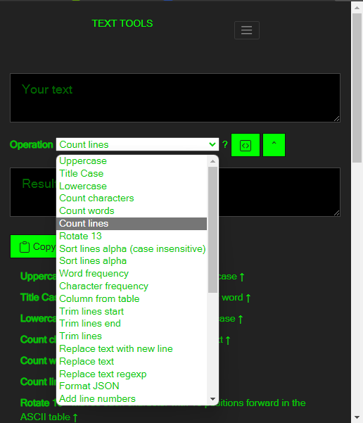

# # Ch07DevTools 

> A need for developers

Ch07DevTools an extension that helps developers with daily tasks:

 - URL Encoding | Decoding 
 -  Hashing Data
 -  Base64 Encoding | Decoding, 
 - Generating random texts
- Manipulating texts
 **No need to use many untruthful websites and wasting your time searching these websites  to do simple tasks with your data**
 **
*With Ch07DevTools just put your data and copy the results*

***

## +40 tools are available:

 - SHA HASHER
 - URL ENCODE | DECODE
 - BASE64 ENCODE | DECODE
 - NUMBER BASE CONVERTOR
 - LOREM GENERATOR
 - TEXT TOOLS
	 - Uppercase
	 - Title Case
	 - Lowercase
	 - Count characters
	 - Count words
	 - Count lines
	 - Rotate 13
	 - Sort lines alpha (case insensitive)
	 - Sort lines alpha
	 - Word frequency
	 - Character frequency
	 - Column from table
	 - Trim lines start
	 - Trim lines end
	 - Trim lines
	 - Replace text with new line
	 - Replace text
	 - Replace text regexp
	 - Format JSON
	 - Add line numbers
	 - Split text
	 - Reverse text
	 - Generate numbers
	 - Unix to date
	 - Identify Hash
	 - Prefix/Suffix lines
	 - Format Numbers
	 - Underscore
	 - Strikeout
	 - Shuffle
	 - Remove duplicate lines
	 - Remove empty lines
	 - Expand template
	 - Indent with spaces
	 - Slugify
	 - Strip non-alphanumeric

***... and more are coming!***

***

# Download

* [Download Version 1.0](https://drive.google.com/uc?id=1OfYyRBk_U6aq4zPUom7y0hsbq9yIQuOl&export=download) 
* [A simple tutorial  how to install it !](https://google.com)

# Screenshots

  

  

  

  

